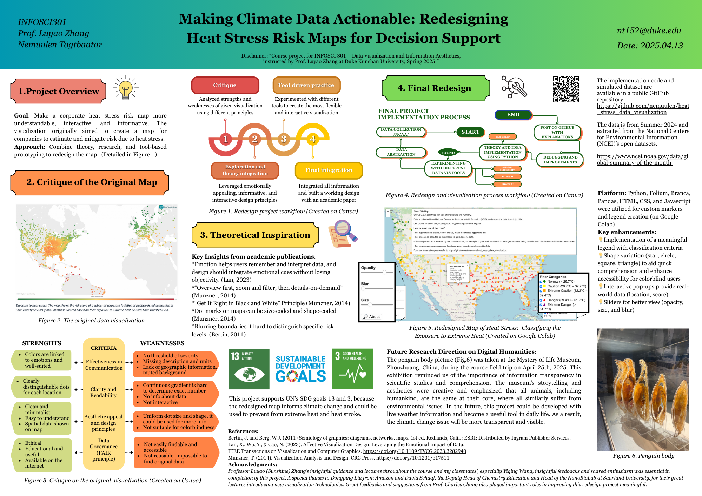

# **Making Climate Data Actionable: Redesigning Heat Stress Risk Maps for Decision Support** 🌎

## ℹ️ Project Information

- **Authors**: Nemuulen Togtbaatar

- **Instructor**: Professor Luyao Zhang, Duke Kunshan University

- **Disclaimer**: Course project for INFOSCI 301 – Data Visualization and Information Aesthetics,
instructed by Prof. Luyao Zhang at Duke Kunshan University, Spring 2025.

- **Acknowledgments**: 

This project represents the culmination of collaborative effort, thoughtful guidance, and the invaluable support of various individuals and resources. We wish to express our sincere gratitude to the following:
   - **Professor and Course Support**
      - **Professor Luyao (Sunshine) Zhang**: Your insightful guidance, engaging lectures, and unwavering support throughout the INFOSCI 301: Data Visualization and Information Aesthetics course were instrumental in shaping this project.
      - **Classmates**: A special thanks to our peers in INFOSCI 301, especially Yuqing Wang, for your insightful discussions and shared enthusiasm, which greatly enriched the quality of this project.
      - **Industry experts and Professors**: Appreciation to Dongping Liu from Amazon and David Schaaf, the Deputy Head of Chemistry Education and Head of the NanoBioLab at Saarland University, for their great lectures introducing new visualization technologies.Great feedbacks and suggestions from Prof. Charles Chang also played important roles in improving this redesign project meaningful.
   - **Open-Source Tools and Libraries** This project heavily relied on the contributions of open-source databases, python, and Java libraries. The following tools and frameworks were used in this project:
      - **Python Libraries**:
         - `pandas` for data processing
         - `folium`  for interactive mapping
         - `branca` for custom HTML injection
      - **JavaScript & HTML**:
         - Dynamic sliders and DOM updates
         - Interactive legend and control panel
      - **GitHub**: For hosting the repository. 
   - **National Centers for Environmental Information (NCEI)**: NCEI provides access to an extensive archive of environmental data through several platforms. Their open data and search system was essential to effective data collection and extraction. 

- **Project Summary**:

  <kbd>
    
  </kbd>

*Figure 1: Project poster. Created on Canva*

  <kbd>
    
  </kbd>

*Figure 2: Project workflow. Created on Canva*

  <kbd>
    
  </kbd>

*Figure 3: Redesign  workflow. Created on Canva*

---

## **Table of Contents** 
* [Overview](./README.md#Overview)
* [Key Features](./README.md#Key-Features)
* [Datasets](./README.md#Datasets)
* [Applications](./README.md#Applications)
* [Getting Started](./README.md#Getting-Started)
* [License](./README.md#License)
* [References](./README.md#References)

---

## **Overview**

This repository focuses on redesigning existing spatial data into a dynamic and browser-based visualization using design principles. The redesigned map shows heat stress risks across the United States using temperature and humidity data. This interactive Folium-based map helps users explore heat index categories with real-time controls for marker appearance, category filtering, and more!

---

## ** 🔑 Key Features**

- Heat Index Classification: Calculates the heat index based on max temperature and relative humidity and classifies according to https://www.weather.gov/ama/heatindex#:~:text=The%20heat%20index%2C%20also%20known,sweat%20to%20cool%20itself%20off.
- **Interactive Map**: Built using Folium and rendered in the browser.
  **Custom Marker Shapes and Colors**:
  - Green Circle → Normal
  - Yellow Rectangle → Caution
  - Orange Rectangle → Extreme Caution
  - Red Triangle → Danger
  - Purple Triangle → Extreme Danger
  
- **Filter by Category**: Toggle visible categories using checkboxes.
- **Sliders**: Adjust opacity, blur, and marker size interactively.
- **Popups with Context**: Shows location name, heat index (°C), temperature (TMAX), and humidity (RHAV).
- **About toggle panel** with info and instructions.

---

## **Datasets**

### **National Centers for Environmental Information (NCEI)**
NCEI provides access to an extensive archive of environmental data through several platforms. The current data is from July, 2024 and extracted from The Global Summary Of The Month (GSOM) Data Files. It contains quality-controlled monthly summaries of more than 50 elements (max temp, snow, etc.) computed from stations in the Global Historical Climatology Network (GHCN)-Daily dataset. 
[https://www.ncei.noaa.gov/access/search/order-status ](https://www.ncei.noaa.gov/data/global-summary-of-the-month/)

The documentation:
[View the documentation (PDF)](https://github.com/nemuulen/heat_stress_data_visualization/blob/main/GSOM_documentation.pdf)

---

## **Applications**

* **Corporate Risk Management**
	- Fortune 500 firms use this type of data to prioritize resilience-building efforts, both internally and with suppliers.
	- Helps identify vulnerable facilities that may require infrastructure upgrades or adaptive operational planning.

* **Urban & Regional Planning**
  	- Municipal governments can use this tool to pinpoint heat hotspots and guide urban cooling strategies, such as planting trees or changing building materials.
	- Helps prioritize emergency response planning in high-risk zones.

* **Real Estate Investment**
  	- Real estate investors gain asset-level insights into climate risk, informing portfolio diversification and investment strategies.
	- Data-driven conversations with property managers and developers help in climate-proofing buildings and neighborhoods.

* **Financial & Bond Markets**
  	- Municipal bond investors can evaluate the climate risk of issuers’ assets and encourage risk-reduction investments.
	- Facilitates more transparent climate disclosures and supports ESG (Environmental, Social, Governance) reporting.

* **Climate Resilience & Policy**
  	- Empowers policymakers and sustainability leaders to design targeted adaptation measures.
	- Enables collaboration between businesses, governments, and communities to build climate resilience and reduce long-term losses.

---

## **Getting Started**

### **Prerequisites**
- Python 3.6 or higher
- Required libraries:
  - `pandas`
  - `folium`
  - `branca`

### **How to run?**
1. Use Google Colab or any equivalent environment and import the code.
2. Import the dataset.
3. Run the whole code.
4. Open the saved HTML file in your browser.
---

## **Navigation Instructions**

This repository is organized to facilitate ease of access to all components of the project. Below is an overview of where to find key resources:

- **Code for Simulations, Data Processing, and Visualizations**:
  - Located in the ['US_heat_stress_risk_data_visualization.ipynb'](https://github.com/nemuulen/heat_stress_data_visualization/blob/main/US_heat_stress_risk_data_visualization.ipynb).

- **Sample Datasets or Processed Data**:
  - Found in the [Data](https://github.com/nemuulen/heat_stress_data_visualization/blob/main/US_temp_rh_data.csv).
  - Contains raw and processed datasets.

- **Pilot Visualizations or Figures**:
  - Stored in the [`Visualization`](https://github.com/nemuulen/heat_stress_data_visualization/blob/main/interactive_heat_index_map-final.html).
    

  <kbd>
    
  </kbd>

*Figure 4: Redesigned map.*

---

## **License**
This project is licensed under the MIT License. 

Copyright (c) 2025 Nemuulen Togtbaatar

Permission is hereby granted, free of charge, to any person obtaining a copy
of this software and associated documentation files (the "Software"), to deal
in the Software without restriction, including without limitation the rights
to use, copy, modify, merge, publish, distribute, sublicense, and/or sell
copies of the Software, and to permit persons to whom the Software is
furnished to do so, subject to the following conditions:

The above copyright notice and this permission notice shall be included in all
copies or substantial portions of the Software.

THE SOFTWARE IS PROVIDED "AS IS", WITHOUT WARRANTY OF ANY KIND, EXPRESS OR
IMPLIED, INCLUDING BUT NOT LIMITED TO THE WARRANTIES OF MERCHANTABILITY,
FITNESS FOR A PARTICULAR PURPOSE AND NONINFRINGEMENT. IN NO EVENT SHALL THE
AUTHORS OR COPYRIGHT HOLDERS BE LIABLE FOR ANY CLAIM, DAMAGES OR OTHER
LIABILITY, WHETHER IN AN ACTION OF CONTRACT, TORT OR OTHERWISE, ARISING FROM,
OUT OF OR IN CONNECTION WITH THE SOFTWARE OR THE USE OR OTHER DEALINGS IN THE
SOFTWARE.

---

## **References**
This project builds upon dataset(s) in:
- National Centers for Environmental Information (NCEI): [Dataset]([https://arxiv.org/abs/2005.00857](https://www.ncei.noaa.gov/))
